<html class="light" lang="id"><head>

 <meta charset="utf-8"/>
<meta content="width=device-width, initial-scale=1.0" name="viewport"/>

<title>ATK SEJAHTERA - Instrumen Profesional Modern</title>

<link href="https://fonts.googleapis.com/css2?family=Newsreader:ital,opsz,wght@0,6..72,400;0,6..72,700;0,6..72,800;1,6..72,400&amp;family=Work+Sans:wght@400;500;600&amp;display=swap" rel="stylesheet"/>
<link href="https://fonts.googleapis.com/css2?family=Material+Symbols+Outlined:wght,FILL@100..700,0..1&amp;display=swap" rel="stylesheet"/>
 <head>
    
     
 </head>

<body class="bg-surface text-on-surface font-body selection:bg-gold/30">
<!-- Top Navigation Shell -->
<nav class="sticky top-0 w-full z-50 bg-slate-50/80 backdrop-blur-md shadow-xl shadow-slate-900/5 transition-all duration-300">

            ATK SEJAHTERA
        

<a class="font-body text-sm tracking-wide font-semibold text-secondary border-b-2 border-secondary pb-1" href="#home">Beranda</a>
<a class="font-body text-sm tracking-wide text-primary hover:text-secondary transition-colors" href="#catalog">Katalog</a>
<a class="font-body text-sm tracking-wide text-primary 14171485931-secondary transition-colors" href="#catalog">Tentang Kami</a>

</nav>
<!-- Hero Section -->
<header class="relative pt-24 pb-32 overflow-hidden hero-gradient text-on-primary" id="home">

“Warisan • Sejak 2010”
<h1 style="color: white;" class="text-5xl md:text-7xl font-headline font-extrabold tracking-tight mb-8 leading-[1.05]">
                Solusi Kebutuhan Kantor
Terbaik &amp; Terpercaya
</h1>

                Menghadirkan kurasi instrumen tulis profesional untuk mendukung ketajaman karya Anda. Dedikasi kami adalah memastikan produktivitas Anda tanpa kompromi.
            

  

    <ul>
    <strong>cara pesan</strong>
      <li>-pilih produk yang diinginkan</li>
      <li>-ketuk + untuk menambahkan produk 1 pack dan ketuk - untuk mengurangi 1 pack produk</li>
      <li>-jika selesai pesan gulir sampai ke keranjang belanja dan pastikan untuk cek pesanan kalau ada produk yang gk jadi dipesan klik tombol X maka pesanan dihapus</li>
    </ul>
  

  
  
  

</header>

<!-- Product Grid -->

<!-- Product Card 1 -->

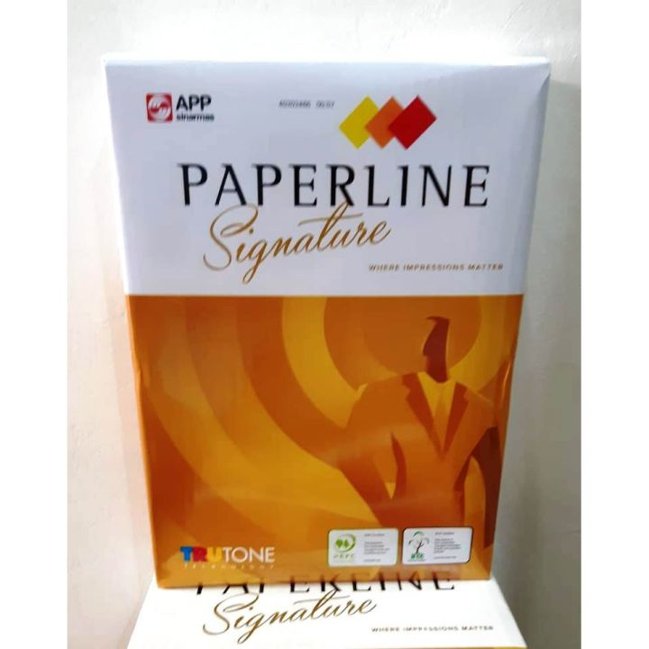

Kertas & Media
<h3 class="text-xl font-headline font-bold text-primary mb-6 flex-grow">Paperline A4 80gsm</h3>

Harga Per Rim

Rp 55.000

<button onclick="remove('Paperline A4 80gsm')" 
class="px-3 py-1 bg-red-500 text-white rounded">-</button>
<button onclick="add('Paperline A4 80gsm',55000)" 
class="px-3 py-1 bg-green-500 text-white rounded">+</button>

    <!-- Product Card 2 -->

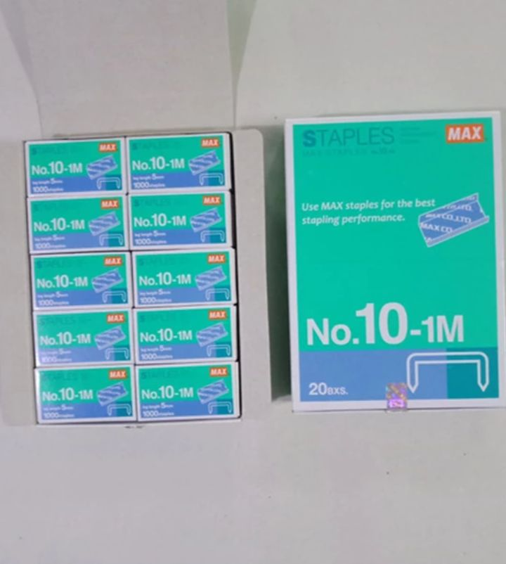

penjilidan & peralatan
<h3 class="text-xl font-headline font-bold text-primary mb-6 flex-grow">isi stapler Joyko HD-10</h3>

Harga Per paket(20 kotak kecil)

Rp 23.000

<button onclick="remove('isi stapler Joyko HD-10')" 
    class="px-3 py-1 bg-red-500 text-white rounded">-</button>

  <button onclick="add('isi stapler Joyko HD-10',23000)" 
    class="px-3 py-1 bg-green-500 text-white rounded">+</button>
  

  <!-- Product Card 3 -->

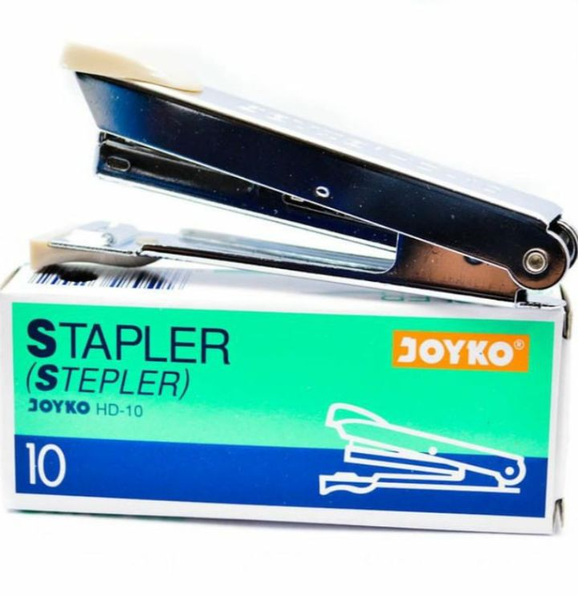

Penjilidan & Peralatan
<h3 class="text-xl font-headline font-bold text-primary mb-6 flex-grow">Joyko HD-10 Stapler</h3>

Harga Satuan

Rp 15.000

<button onclick="remove(' stapler Joyko HD-10')" 
    class="px-3 py-1 bg-red-500 text-white rounded">-</button>

  <button onclick="add('stapler Joyko HD-10',15000)" 
    class="px-3 py-1 bg-green-500 text-white rounded">+</button>

<!-- Product Card 4 -->

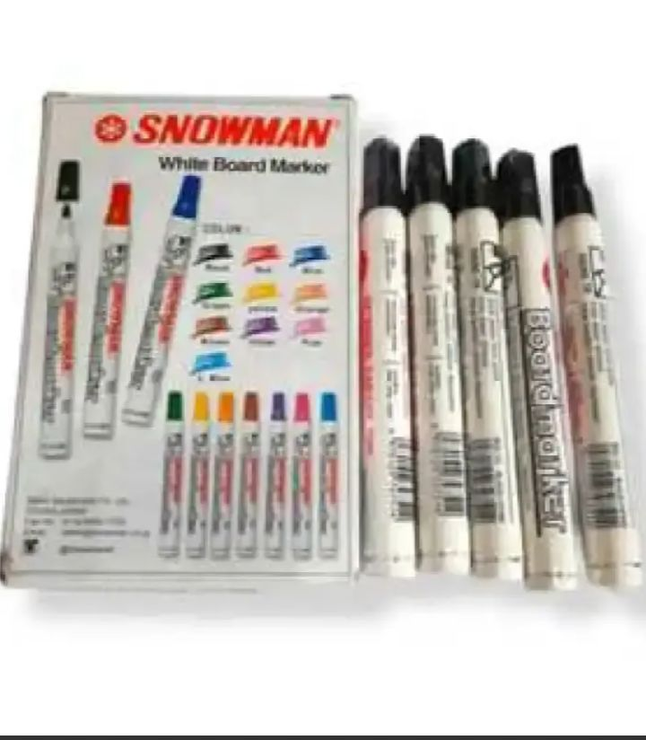

Alat tulis
<h3 class="text-xl font-headline font-bold text-primary mb-6 flex-grow">Snowman Board Marker</h3>

Harga Per pack(12 pcs)

Rp 80.000

<button onclick="remove('Snowman Board Marker')" 
class="px-3 py-1 bg-red-500 text-white rounded">-</button>

<button onclick="add('Snowman Board Marker',80000)" 
class="px-3 py-1 bg-green-500 text-white rounded">+</button>

  <!-- Product Card 5 -->

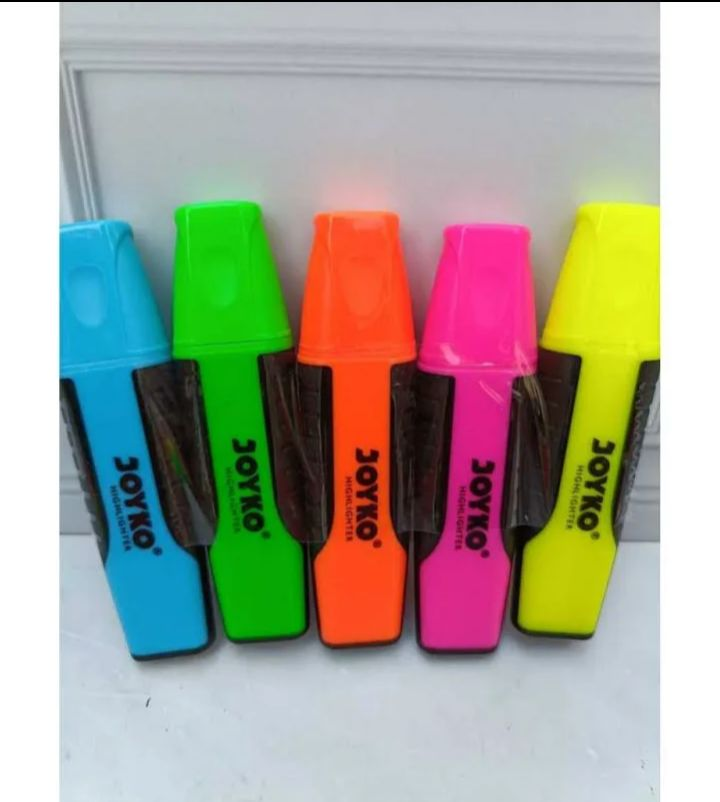

Peralatan
<h3 class="text-xl font-headline font-bold text-primary mb-6 flex-grow">Highlighter Joyko</h3>

Harga per pack(10 pcs)

Rp 25.000

  <button onclick="remove('Highlighter Joyko')" 
    class="px-3 py-1 bg-red-500 text-white rounded">-</button>

  <button onclick="add('Highlighter Joyko',25000)" 
    class="px-3 py-1 bg-green-500 text-white rounded">+</button>

  <!-- Product Card 6 -->

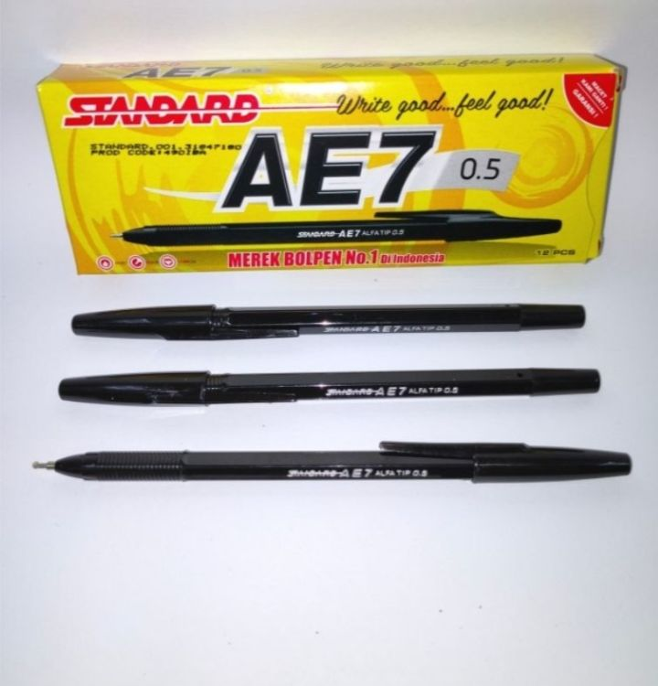

Alat Tulis
<h3 class="text-xl font-headline font-bold text-primary mb-6 flex-grow">Pulpen Standar AE7</h3>

Harga Per pack(12 pcs)

Rp 23.000

<button onclick="remove('Pulpen Standar AE7')" 
    class="px-3 py-1 bg-red-500 text-white rounded">-</button>

  <button onclick="add('Pulpen Standar AE7',23000)" 
    class="px-3 py-1 bg-green-500 text-white rounded">+</button>

 <!-- Product Card 7 -->

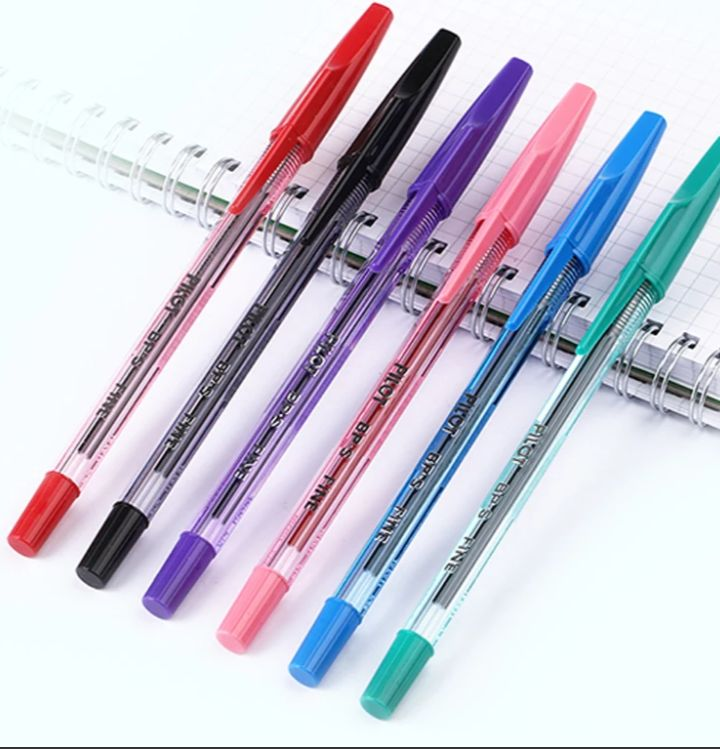

Alat tulis
<h3 class="text-xl font-headline font-bold text-primary mb-6 flex-grow">Pilot BP-S,pulpen tinta halus</h3>

Harga Per pack(12 pcs)

Rp 20.000

<button onclick="remove('Pilot BP-S,pulpen tinta halus')" 
    class="px-3 py-1 bg-red-500 text-white rounded">-</button>

  <button onclick="add('Pilot BP-S,pulpen tinta halus',20000)" 
    class="px-3 py-1 bg-green-500 text-white rounded">+</button>  

<!-- Product Card 8 -->

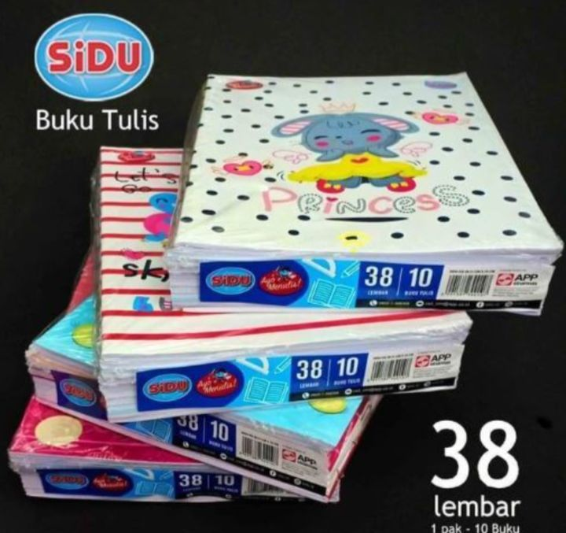

Kertas & media
<h3 class="text-xl font-headline font-bold text-primary mb-6 flex-grow">Buku sidu (isi 38 lembar)</h3>

Harga per pack(12 pcs)

Rp 35.000

<button onclick="remove('Buku sidu (isi 38 lembar)')" 
    class="px-3 py-1 bg-red-500 text-white rounded">-</button>

  <button onclick="add('Buku sidu (isi 38 lembar)',35000)" 
    class="px-3 py-1 bg-green-500 text-white rounded">+</button>

<!-- Product Card 9 -->

Kertas & Media
<h3 class="text-xl font-headline font-bold text-primary mb-6 flex-grow">Post-it 3M 654 (73x73mm),catatan tempel </h3>

Harga per pack(100 lembar)

Rp 16.000

<button onclick="remove('Post-it 3M 654 (73x73mm),catatan tempel')" 
    class="px-3 py-1 bg-red-500 text-white rounded">-</button>

  <button onclick="add('Post-it 3M 654 (73x73mm),catatan tempel',16000)" 
    class="px-3 py-1 bg-green-500 text-white rounded">+</button>

<!-- Product Card 10 -->

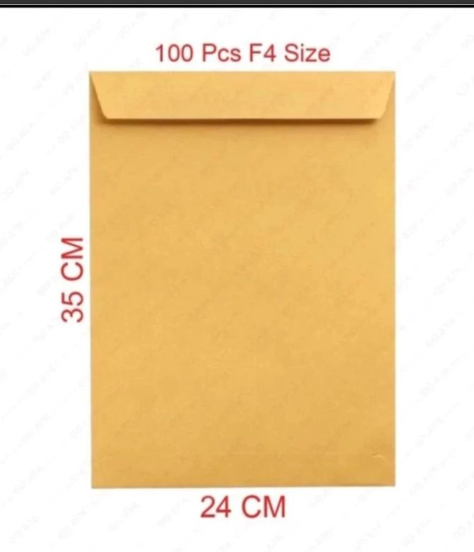

Kertas & media
<h3 class="text-xl font-headline font-bold text-primary mb-6 flex-grow">Amplop coklat F4</h3>

Harga per pack(isi 100 lembar)

Rp 45.000

<button onclick="remove('Amplop coklat F4')" 
    class="px-3 py-1 bg-red-500 text-white rounded">-</button>

  <button onclick="add('Amplop coklat F4',45000)" 
    class="px-3 py-1 bg-green-500 text-white rounded">+</button>

<!-- Product Card 11 -->

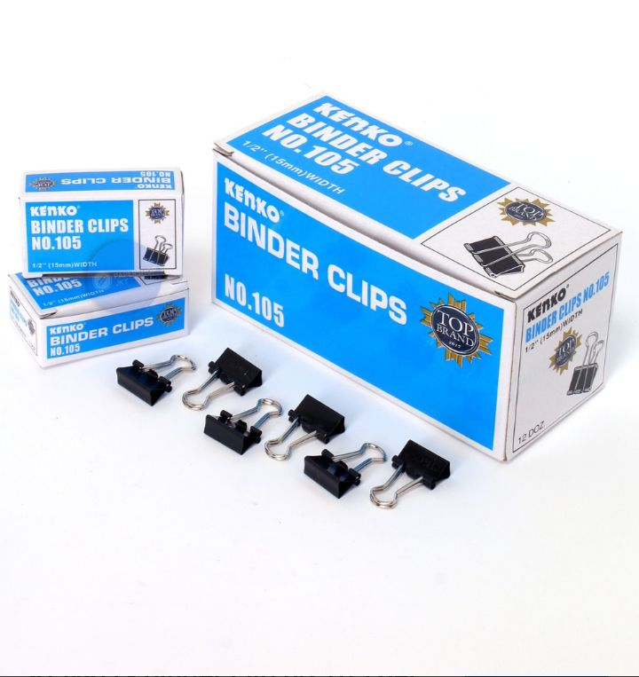

Penjilidan dan peralatan
<h3 class="text-xl font-headline font-bold text-primary mb-6 flex-grow">Binder clip Kenko</h3>

Harga per pack(12 pcs)

Rp 6.000

<button onclick="remove('Binder clip Kenko')" 
    class="px-3 py-1 bg-red-500 text-white rounded">-</button>

  <button onclick="add('Binder clip Kenko',6000)" 
    class="px-3 py-1 bg-green-500 text-white rounded">+</button>

<!-- Product Card 12 -->

Penjilidan & Peralatan
<h3 class="text-xl font-headline font-bold text-primary mb-6 flex-grow">Penjepit Kertas</h3>

Harga per box(100 pcs)

Rp 14.000

<button onclick="remove('Penjepit Kertas')" 
    class="px-3 py-1 bg-red-500 text-white rounded">-</button>

  <button onclick="add('Penjepit Kertas',14000)" 
    class="px-3 py-1 bg-green-500 text-white rounded">+</button>

<!-- Product Card 13 -->

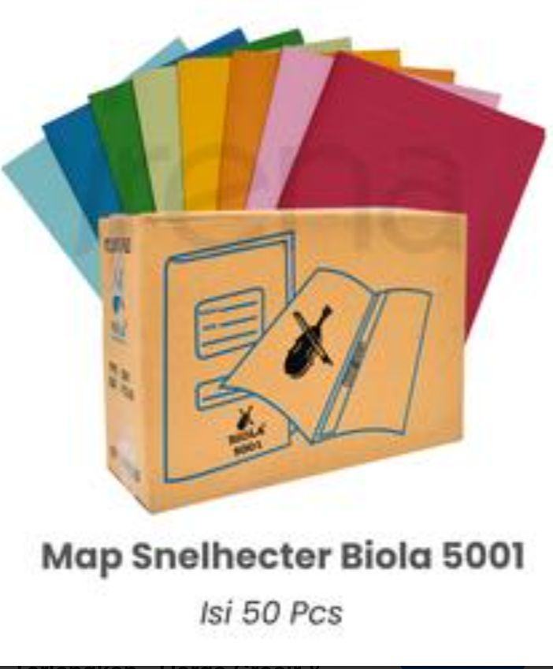

Penjilidan & Peralatan
<h3 class="text-xl font-headline font-bold text-primary mb-6 flex-grow">Map snelhecter arsip dengan penjepit</h3>

Harga per pack

Rp 150.000

<button onclick="remove('Map snelhecter arsip dengan penjepit')" 
    class="px-3 py-1 bg-red-500 text-white rounded">-</button>

  <button onclick="add('Map snelhecter arsip dengan penjepit',150000)" 
    class="px-3 py-1 bg-green-500 text-white rounded">+</button>

<!-- Product Card 14 -->

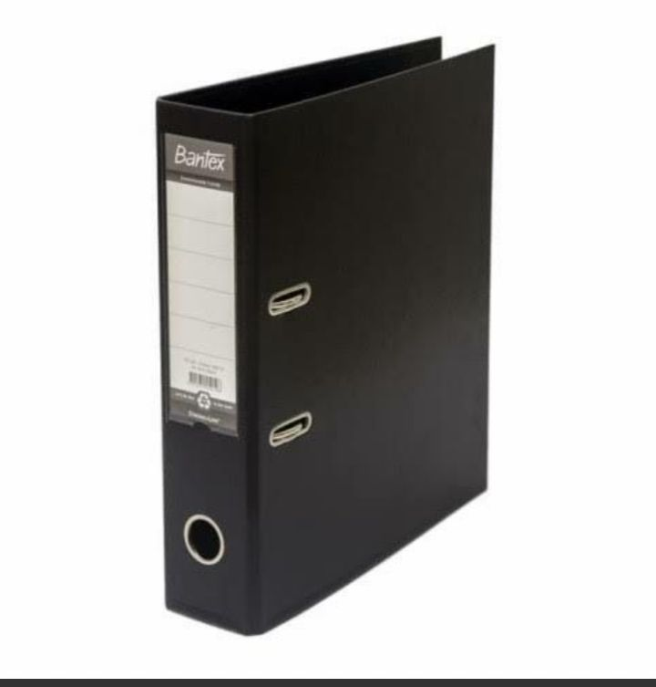

Penjilidan dan peralatan
<h3 class="text-xl font-headline font-bold text-primary mb-6 flex-grow">Ordner/Binder Bantex </h3>

Harga per pack(15 pcs)

Rp 550.000

<button onclick="remove('Ordner/Binder Bantex')" 
    class="px-3 py-1 bg-red-500 text-white rounded">-</button>

  <button onclick="add('Ordner/Binder Bantex',550000)" 
    class="px-3 py-1 bg-green-500 text-white rounded">+</button>

<!-- Product Card 15 -->

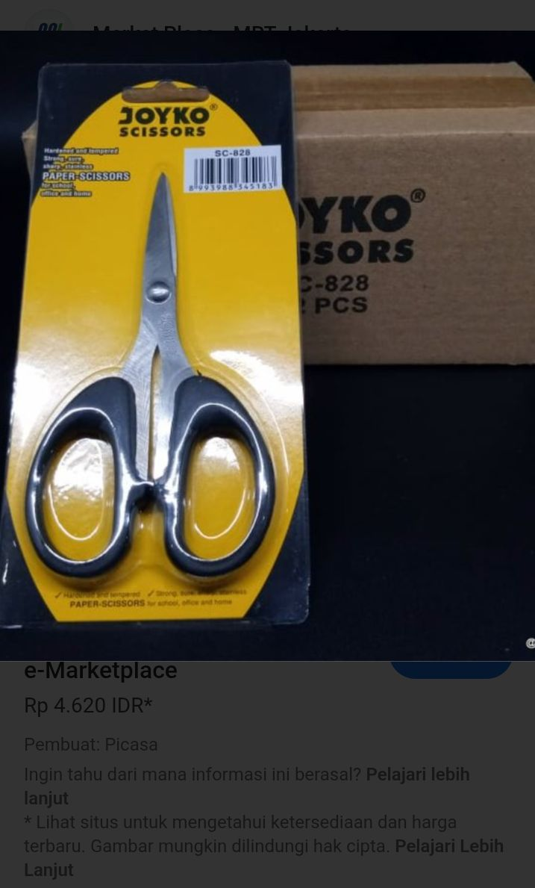

Peralatan
<h3 class="text-xl font-headline font-bold text-primary mb-6 flex-grow">Gunting Joyko(sc-828)</h3>

Harga per pack(12 pcs)

Rp 55.000

<button onclick="remove('Gunting Joyko(sc-828)')" 
    class="px-3 py-1 bg-red-500 text-white rounded">-</button>

  <button onclick="add('Gunting Joyko(sc-828)',55000)" 
    class="px-3 py-1 bg-green-500 text-white rounded">+</button>

<!-- Product Card 16 -->

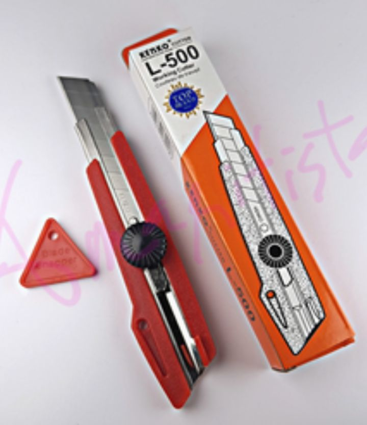

Peralatan
<h3 class="text-xl font-headline font-bold text-primary mb-6 flex-grow">cutter kenko</h3>

Harga per pack( 1 pcs)

Rp 20.000

<button onclick="remove('cutter kenko')" 
    class="px-3 py-1 bg-red-500 text-white rounded">-</button>

  <button onclick="add('cutter kenko',20000)" 
    class="px-3 py-1 bg-green-500 text-white rounded">+</button>

<!-- Product Card 17 -->

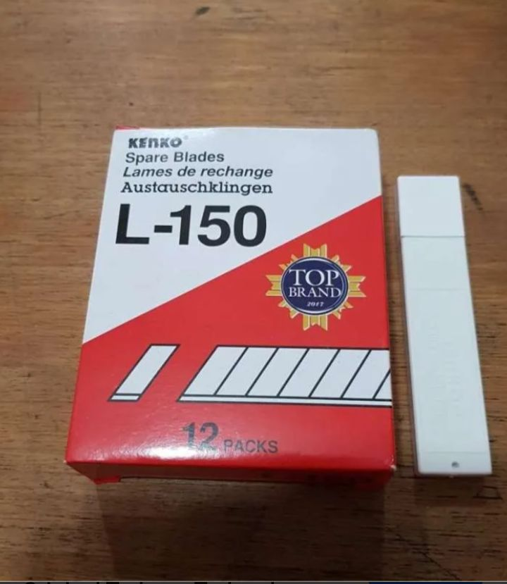

Peralatan
<h3 class="text-xl font-headline font-bold text-primary mb-6 flex-grow">isi cutter kenko</h3>

Harga per tube kecil(5 pcs)

Rp 10.000

<button onclick="remove('isi cutter kenko')" 
    class="px-3 py-1 bg-red-500 text-white rounded">-</button>

  <button onclick="add('isi cutter kenko',10000)" 
    class="px-3 py-1 bg-green-500 text-white rounded">+</button>

<!-- Product Card 18 -->

  

  
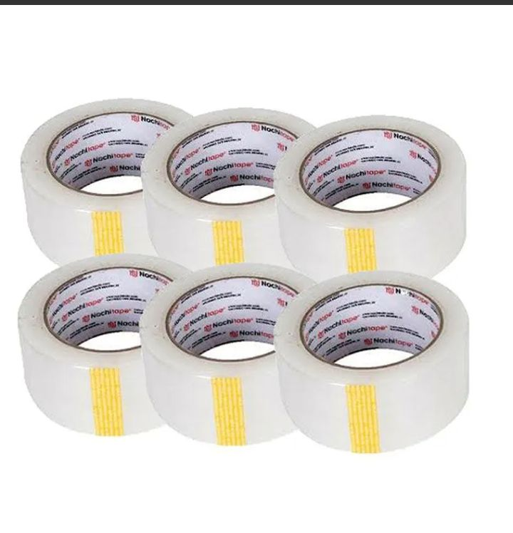  

  

  

  

  
Peralatan  
<h3 class="text-xl font-headline font-bold text-primary mb-6 flex-grow">Lakban daimaru/nachi</h3>  

  

Paket 6 roll
  

  

Rp 50.000
  

<button onclick="remove('Paket 6 roll')"   
class="px-3 py-1 bg-red-500 text-white rounded">-</button>  

<button onclick="add('Paket 6 roll',50000)"   
class="px-3 py-1 bg-green-500 text-white rounded">+</button>  

  

  

  

  <!-- KANAN -->
  

<!-- 🛒 Keranjang -->

<h2>
Keranjang

  
Kosong

  
Total: Rp 0

  <button onclick="checkout()" 
    class="mt-3 px-5 py-2 bg-green-600 text-white rounded">
    Pesan via WhatsApp
  </button>

<!-- About Section -->
<section class="py-40 bg-surface-container-low relative overflow-hidden" id="about">

history_edu

Our Legacy
<h2 class="text-6xl font-headline font-extrabold text-primary leading-[1.1] mb-10">Presisi dalam  Setiap Goresan.</h2>

Kami percaya bahwa alat tulis kantor bukan sekadar pelengkap, melainkan instrumen esensial yang menjembatani ide dan realitas. Di ATK Sejahtera, kami mengkurasi setiap produk dengan standar akurasi tinggi.

Sejak tahun 2010, kami telah menjadi mitra terpercaya bagi ribuan profesional dan korporasi dalam menyediakan solusi ATK yang efisien, cepat, dan berkualitas unggul.

99%

Kepuasan Klien

24hr

Layanan Ekspres

verified

<h4 class="text-2xl font-headline font-bold text-white mb-8 serif-italic">Standar Kualitas Sejahtera</h4>
<ul class="space-y-8">
<li class="flex items-start gap-6">
check_circle

<h5 class="text-white font-bold tracking-wide uppercase text-sm mb-1">Kurasi Original</h5>

Jaminan keaslian 100% untuk seluruh produk yang kami sediakan.

</li>
<li class="flex items-start gap-6">
check_circle

<h5 class="text-white font-bold tracking-wide uppercase text-sm mb-1">Pengadaan Korporasi</h5>

Solusi khusus untuk kebutuhan partai besar dan kontrak kantor.

</li>
<li class="flex items-start gap-6">
check_circle

<h5 class="text-white font-bold tracking-wide uppercase text-sm mb-1">Logistik Terpadu</h5>

Sistem pengiriman terjadwal untuk memastikan stok kantor selalu tersedia.

</li>
</ul>

<h1>Pengunjung: 0</h1>

